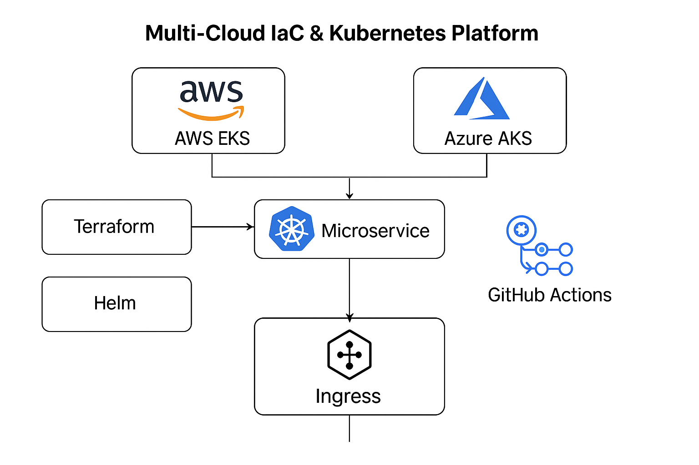

# 🌐 Multi-Cloud Kubernetes Platform with Terraform, Helm, GitHub Actions, and Minikube


> 🚀 Provision infrastructure in AWS or Azure using Terraform, deploy a FastAPI microservice using Helm, and automate the entire DevOps lifecycle via GitHub Actions — with local Minikube support for cloud-free testing.

---

## 📁 Project Structure

```text
multi-cloud-k8s-platform/
├── app/                      # FastAPI microservice (Dockerized)
├── helm/                    # Helm chart for deployment
├── terraform/
│   ├── aws/                 # Terraform for AWS EKS
│   └── azure/               # Terraform for Azure AKS
├── .github/workflows/       # CI/CD for infra + app
├── docs/                    # Architecture diagram & usage guide
└── README.md
```

---

## 🧰 Tech Stack
- **Cloud Providers:** AWS (EKS), Azure (AKS)
- **Infrastructure as Code:** Terraform
- **Kubernetes Deployment:** Helm
- **CI/CD:** GitHub Actions
- **App:** Python (FastAPI)
- **Containerization:** Docker
- **Local Dev:** Minikube (optional)

---

## 🚀 What This Project Does
- ✅ Deploys managed Kubernetes clusters to AWS (EKS) and Azure (AKS)
- ✅ Installs a FastAPI app via Helm with NGINX Ingress
- ✅ Automates provisioning and deployment via GitHub Actions
- ✅ Supports fully local deployment on Minikube without cloud access

---

## 📊 Architecture Diagram


---

## 📘 Usage

### ✅ Full Setup Instructions
See [docs/usage-guide.md](./docs/usage-guide.md) for:
- GitHub secrets & environment setup
- Deploying to EKS or AKS via GitHub Actions
- Running the full stack locally using Minikube

### 🧪 Health Check Endpoints
After deployment (cloud or local), test:
```bash
curl http://<host>/health
curl http://<host>/hello
```

---

## 📄 License
This project is licensed under the MIT License — see the `LICENSE` file for details.

---

## 👤 Author
**Masudur Rahman**  
Senior Cloud DevOps Engineer — Azure | AWS | Kubernetes | Terraform | CI/CD

🔗 [GitHub](https://github.com/Masudthecloud)

---

> 🌥 Built to demonstrate modern multi-cloud DevOps pipelines with real-world infrastructure and local fallback. Pull requests and ideas welcome!
